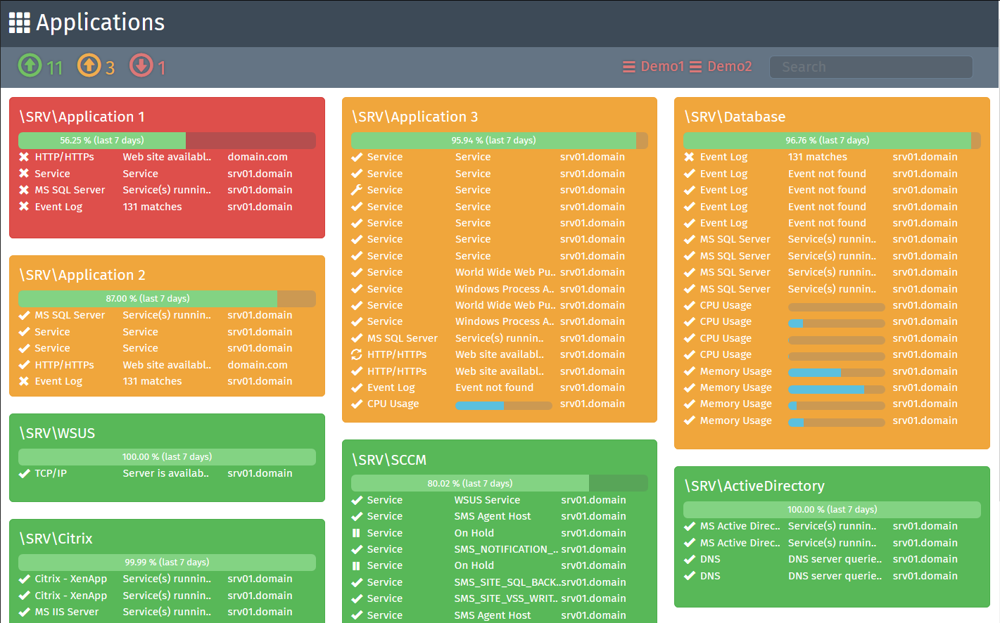

# Dashboard for ActiveXperts Network Monitor

Web-based dashboard for displaying checks exported from ActiveXperts Network Monitor (see www.activexperts.com).



## Features

* Live updates
* Search
* Supports multiple installations of ActiveXperts Network Monitor

## Installation

Manually copy `dashboard.html` and `\dashboard` to `%PROGRAMDATA%\ActiveXperts\Network Monitor\Web`
* For demo purpose also copy the example files `ExampleChecks.xml` and `ExampleAvailability.xml` to `%PROGRAMDATA%\ActiveXperts\Network Monitor\Web`

Prepare datasource files in ActiveXperts Network Monitor
* Use customized report to defined interval for checks data
* Use scheduled task to generate availability data at regular intervals
* See https://www.activexperts.com/files/network-monitor/manual.htm#Report_Module for details

Configure datasource(s) in `%PROGRAMDATA%\ActiveXperts\Network Monitor\Web\dashboard\js\dashboard.js` with url for given checks and availability xml file
```javascript
const settings = {
  datasource: {
      sources: [
        {name: 'ExampleData', checks: {url: 'ExampleChecks.xml'}, availability: {url: 'ExampleAvailabilty.xml'}}
      ]
    }
  };
```

## Usage

Open http://\<ip:port\>/dashboard.html in web browser.

Web browser requirements:
 - ECMAScript 2017 (http://www.ecma-international.org/ecma-262/8.0/index.html)
 - CSS Grid (https://www.w3.org/TR/css-grid-1/)

## History

**0.7**

```
529b768de5f2b78ea1a7b8c1aa03a6ef5ab9b40d New version
31a114094ad5e7a8625c97a85e2926a5b0db23ac Fixed close handling for alerts
16583dc65d547c3e15a8c9cc045d152e61cd0c08 Improved async fetching
47fd1cf0df028113ea0305ed74588c6d54bf4d2c Added automatic clearing of console logging
4114e6807a3770a353c21ab4609951403fcdd07d Improved usage of await
dcac14fd9e57ed86e57cb9e023701545a7f960df Minor refactoring of settings and fetch
b89dec339ccd81e6e665360d1bb9aeda8b912139 Fetch now uses async/await
b6bd556b5e05bdf921c7510c62027a72bf7f0825 Rewrote global functions
91a49ef44714f9c277fb5e273103cf1c748746ba Various text fixes
d6384ccad3deb31adce620d3bd399aa65a507db8 Updraded Bootstrap v4 to beta.3
ed8326b5d1f9c363fe0583cee3282b2642ecdbd1 Refactored datasource
87b55e872b2d9a1eab5b81c00d3f771dc1014037 Modified settings for datasource
```

**0.6**

```
fdb6cb40fa8b496d614fe847687a78153943aa93 New version
ed07eb412ee5b627bd88393654e9dbbd26563558 Fixed fetch same-origin and urls Added console logging Improved tooltips
```

**0.5**

```
ef68ec331ac542b8d1f5c6dc50d5390ed3d7db76 Minor text corrections
26edd564a4a94f2c1d3d464c8fa53565c8fbcef5 Initial commit
32d713c8e38ed02b1f99c4a9c9ac94eddd0e2c50 Initial commit
```

## Credits

Trond Olsen, trond@steinbit.org, Norway

## License

MIT License

Copyright (c) 2017 Trond Olsen

Permission is hereby granted, free of charge, to any person obtaining a copy
of this software and associated documentation files (the "Software"), to deal
in the Software without restriction, including without limitation the rights
to use, copy, modify, merge, publish, distribute, sublicense, and/or sell
copies of the Software, and to permit persons to whom the Software is
furnished to do so, subject to the following conditions:

The above copyright notice and this permission notice shall be included in all
copies or substantial portions of the Software.

THE SOFTWARE IS PROVIDED "AS IS", WITHOUT WARRANTY OF ANY KIND, EXPRESS OR
IMPLIED, INCLUDING BUT NOT LIMITED TO THE WARRANTIES OF MERCHANTABILITY,
FITNESS FOR A PARTICULAR PURPOSE AND NONINFRINGEMENT. IN NO EVENT SHALL THE
AUTHORS OR COPYRIGHT HOLDERS BE LIABLE FOR ANY CLAIM, DAMAGES OR OTHER
LIABILITY, WHETHER IN AN ACTION OF CONTRACT, TORT OR OTHERWISE, ARISING FROM,
OUT OF OR IN CONNECTION WITH THE SOFTWARE OR THE USE OR OTHER DEALINGS IN THE
SOFTWARE.

## Dependencies

This software was built using these additional libraries.

### Bootstrap 4.0.0-beta.3

https://getbootstrap.com/

The MIT License (MIT)

Copyright (c) 2011-2016 Twitter, Inc.

Permission is hereby granted, free of charge, to any person obtaining a copy
of this software and associated documentation files (the "Software"), to deal
in the Software without restriction, including without limitation the rights
to use, copy, modify, merge, publish, distribute, sublicense, and/or sell
copies of the Software, and to permit persons to whom the Software is
furnished to do so, subject to the following conditions:

The above copyright notice and this permission notice shall be included in
all copies or substantial portions of the Software.

THE SOFTWARE IS PROVIDED "AS IS", WITHOUT WARRANTY OF ANY KIND, EXPRESS OR
IMPLIED, INCLUDING BUT NOT LIMITED TO THE WARRANTIES OF MERCHANTABILITY,
FITNESS FOR A PARTICULAR PURPOSE AND NONINFRINGEMENT. IN NO EVENT SHALL THE
AUTHORS OR COPYRIGHT HOLDERS BE LIABLE FOR ANY CLAIM, DAMAGES OR OTHER
LIABILITY, WHETHER IN AN ACTION OF CONTRACT, TORT OR OTHERWISE, ARISING FROM,
OUT OF OR IN CONNECTION WITH THE SOFTWARE OR THE USE OR OTHER DEALINGS IN
THE SOFTWARE.
